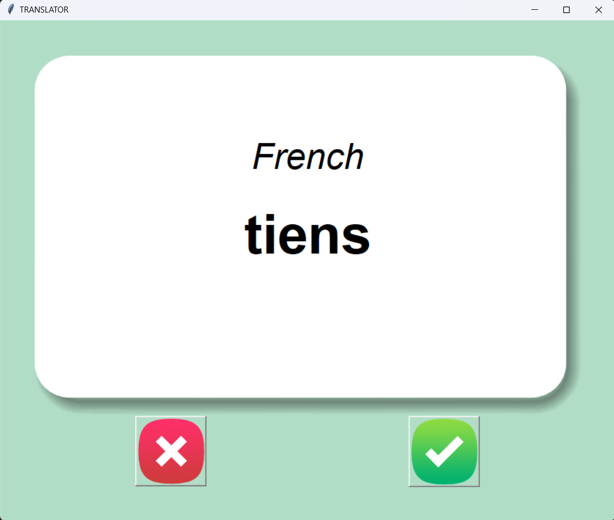

# CARD FLIP TRNSLATOR

## PROGRAM:

```
from tkinter import *
import pandas
import random

BACKGROUND_COLOR = "#B1DDC6"
card = {}
df_dict = {}

try:
    df = pandas.read_csv("data/words_to_learn.csv")
except FileNotFoundError:
    original_data = pandas.read_csv("data/french_words.csv")
    df_dict = original_data.to_dict(orient="records")
else:
    df_dict = df.to_dict(orient="records")

def next_card():
    global card, flip_timer
    window.after_cancel(flip_timer)
    card = random.choice(df_dict)
    canvas.itemconfig(title,text="French",fill="black")
    canvas.itemconfig(ans,text=card["French"],fill="black")
    canvas.itemconfig(card_photo, image=photo_1)
    flip_timer = window.after(3000, func=flip_card)

def flip_card():
    canvas.itemconfig(card_photo, image=photo_2)
    canvas.itemconfig(title, text="English",fill="white")
    canvas.itemconfig(ans, text=card["English"],fill="white")

def is_know():
    df_dict.remove(card)
    new_file = pandas.DataFrame(df_dict)
    new_file.to_csv("data/words_to_learn.csv")
    next_card()
    
window = Tk()
window.title("TRANSLATOR")
window.config(pady=50,padx=50,bg=BACKGROUND_COLOR)

flip_timer = window.after(3000, func=flip_card)

canvas = Canvas(width=800,height=530)
photo_1 = PhotoImage(file="images/card_front.png")
photo_2  = PhotoImage(file="images/card_back.png")
card_photo = canvas.create_image(400,265,image=photo_1)
title = canvas.create_text(400,150,text="",font=("Arial",40,"italic"))
ans = canvas.create_text(400,263,text="",font=("Arial",60,"bold"))
canvas.config(background=BACKGROUND_COLOR,highlightthickness=0)
canvas.grid(row=0,column=0,columnspan=2)


wrong_btn_pht = PhotoImage(file="images/wrong.png")
wrong_button = Button(image=wrong_btn_pht,highlightthickness=0,command=next_card)
wrong_button.grid(row=1,column=0)


right_btn_pht = PhotoImage(file="images/right.png")
right_button = Button(image=right_btn_pht,highlightthickness=0,command=is_know)
right_button.grid(row=1,column=1)


next_card()

window.mainloop()

```

## PICTURES:



## OUTPUT
